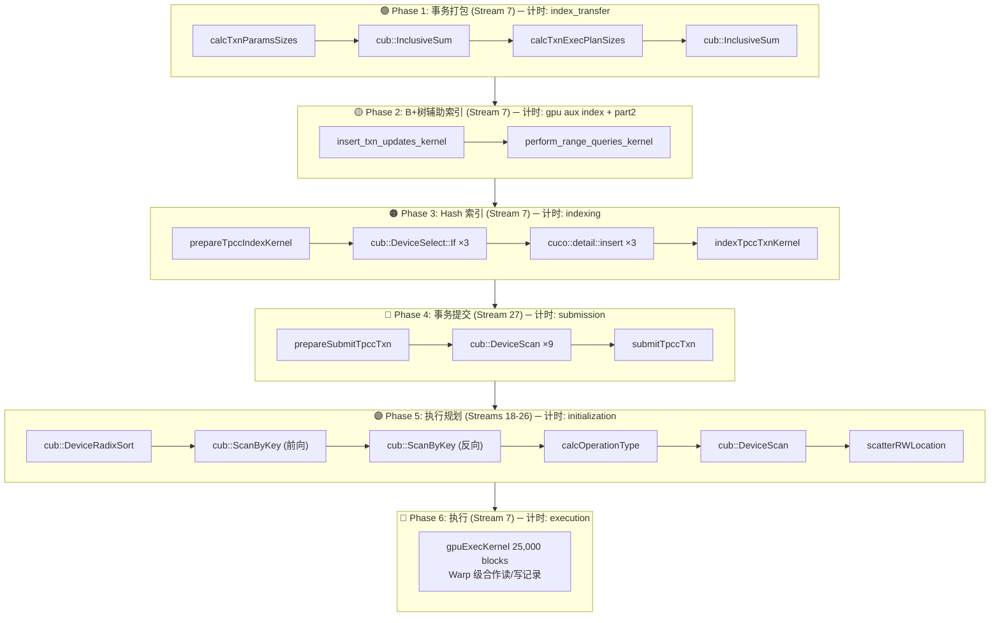

# EPIC TPCC GPU 事务处理全流程详解

> 本文档整合了 Kernel 调用逻辑（txn.md）和 Epoch 阶段计时（epoch.md），提供一个从源码到性能的完整视图。

---

## 目录

1. [总体架构](#1-总体架构)
2. [Epoch 流水线全景](#2-epoch-流水线全景)
3. [六大阶段详解](#3-六大阶段详解)
   - [Phase 1: 事务打包](#phase-1-事务打包)
   - [Phase 2: B+树辅助索引](#phase-2-b树辅助索引)
   - [Phase 3: Hash 索引构建](#phase-3-hash-索引构建)
   - [Phase 4: 事务提交](#phase-4-事务提交)
   - [Phase 5: 执行规划](#phase-5-执行规划)
   - [Phase 6: 执行](#phase-6-执行)
4. [源码对照表](#4-源码对照表)
5. [性能数据示例](#5-性能数据示例)
6. [TPM 计算讨论](#6-tpm-计算讨论)
7. [重点 Kernel 总结](#7-重点-kernel-总结)

---

## 1. 总体架构

EPIC 的 GPU 事务处理采用 **批量预解析** 模式：在一个 epoch 开始时，所有事务的完整读写集被预先计算出来，然后分阶段将索引、执行规划、数据读写分别在 GPU 上完成。

### 关键设计特点

| 项目 | 说明 |
|------|------|
| **事务模型** | 每 epoch 批量处理 N 个事务（本文例：100,000） |
| **读写集** | 在 `gpuExecKernel` 执行前已全部预计算完毕 |
| **索引** | B+Tree（辅助索引）+ Cuco HashMap（主索引） |
| **版本控制** | Record A / Record B / Version 三级存储，事务内 Warp 合作读写 |
| **并行度** | 每个 Warp（32 线程）合作处理 1 个事务，25000 个 Warp 同时工作 |

### 9 张 TPCC 表

| 表名 | 操作数 (示例) | 执行规划 Stream |
|------|:----------:|:--------------:|
| Warehouse | 130,961 | Stream 18 |
| District | 175,940 | Stream 19 |
| Customer | 215,013 | Stream 20 |
| History | 0 | — |
| New Order | 84,999 | Stream 22 |
| Order | 129,031 | Stream 23 |
| Order Line | 1,292,708 | Stream 24 |
| Item | 448,967 | Stream 25 |
| Stock | 1,688,849 | Stream 26 |

---

## 2. Epoch 流水线全景



### 流水线时间线（示例数据: 100K txns, 1 warehouse, Epoch 5）

```
时间轴 (μs)
0        5,000     10,000    15,000    20,000                                        85,000

├── Phase 1 ──┤├─Ph2─┤├─── Phase 3 ───┤├─Ph4┤├── Phase 5 ──┤├────────── Phase 6 ─────────────────┤
│   transfer   │ aux │  indexing     │ sub │ initializ.   ││        gpuExecKernel              │
│   1,046μs    │1,775│  2,237μs      │802μs│  1,512μs     ││        62,867μs                   │
└──────────────┴─────┴───────────────┴─────┴──────────────┘└──────────────────────────────────┘
                                                                          ↑
                                                         cudaDeviceSynchronize() 在此等待

总计端到端: 70,239 μs ≈ 70.2 ms (平均 ~1.42M tps 等效)
Phase 6 占比: 89.5%
```

> **关键**：Phase 2–5 的 GPU kernel 在 `execution` 开始前已通过 `FinishInitialization()` 内部的 `cudaStreamSynchronize` 全部完成。`execution` 计时只包含 Phase 6 的 `gpuExecKernel`。

---

## 3. 六大阶段详解

### Phase 1: 事务打包

**计时标签**: `index_transfer` (与 CPU→GPU 数据传输合并计时)

**源码位置**: `tpcc.cpp:364-391`

**包含操作**:
1. `input_index_bridge.Link()` → `StartTransfer()` → `FinishTransfer()` (CPU→GPU 数据拷贝)
2. `packed_txn_array_builder.buildPackedTxnArrayGpu(index_input, index_output)` (Phase 1 kernel)
3. `packed_txn_array_builder.buildPackedTxnArrayGpu(index_input, initialization_output)`

**GPU Kernel 流程** (`tpcc_gpu_txn.cu`):
```
calcTxnParamsSizes <<<196, 512>>>
  ↓ 每个线程根据 txn_type 查表得到事务参数大小
cub::DeviceScan::InclusiveSum
  ↓ 前缀和 → 得到每个事务在 PackedArray 中的 offset
calcTxnExecPlanSizes <<<196, 512>>>
  ↓ 同理计算每个事务的 ExecutionPlan 大小
cub::DeviceScan::InclusiveSum
  ↓ 前缀和 → 得到执行计划的 offset
```

### Phase 2: B+树辅助索引

**计时标签**: `gpu aux index` + `gpu aux index part2`

**源码位置**: `tpcc.cpp:397-412` (`tpcc_gpu_aux_index.cu`)

**目的**: 为 OrderStatus、Delivery、StockLevel 事务提供 `(warehouse, district, customer) → order` 的 B+Tree 查找。

**第 1 部分 - 插入** (`gpu aux index`):
```
insert_txn_updates_kernel <<<196, 512>>>
  对每个 NewOrder 事务:
    构造 PackedCustomerOrderKey{w_id, d_id, c_id, max_o_id - o_id}
    ↓
    B+Tree cooperative_insert (Tile 级合作, 16 线程/tile)
  同时缓存 order_num_items[], order_customers[], order_items[][15]
```

**第 2 部分 - 范围查询** (`gpu aux index part2`):
```
perform_range_queries_kernel <<<196, 512>>>
  对每种事务:
    ├─ OrderStatus: B+Tree.find_next 查找用户最近订单
    ├─ Delivery:    遍历 10 个 district，获取每区订单详情
    └─ StockLevel:  扫描最近 20 个订单的 items，WarpMergeSort 去重排序
```

### Phase 3: Hash 索引构建

**计时标签**: `indexing`

**源码位置**: `tpcc.cpp:415-420` → `index->indexTxns()` (`tpcc_gpu_index.cu`)

```
prepareTpccIndexKernel <<<196, 512>>>
  ↓ 对每种事务类型准备复合 key (OrderKey, NewOrderKey, OrderLineKey)
  ↓ 非 NewOrder 事务填充 -1 表示不需要索引
cub::DeviceSelect::If ×3
  ↓ 分别过滤出 ORDER_INSERT / NEW_ORDER_INSERT / ORDER_LINE_INSERT 操作
cuco::detail::insert ×3 <<<N, 128>>>
  ↓ 插入 3 张 cuco static_map 哈希表 (O(1) 查找)
indexTpccTxnKernel <<<196, 512>>>
  ↓ 构建最终 tpccGpuIndexFindView (供 gpuExecKernel 中的索引查找使用)
```

### Phase 4: 事务提交

**计时标签**: `submission`

**源码位置**: `tpcc.cpp:469-472` → `submitter->submit()` (`tpcc_gpu_submitter.cu`)

```
prepareSubmitTpccTxn <<<98, 1024>>>  (Stream 27)
  ↓ 每个事务计算其操作数 (read/write count per table)
  ↓ 存储到 num_ops[9] 数组中
cub::DeviceScan ×9
  ↓ 每个表一个 stream (Stream 27-35)，前缀和得到全局偏移
submitTpccTxn <<<98, 1024>>>  (Stream 27)
  ↓ 将每个操作编码为 op_t: record_id | txn_id | r/w | offset
  ↓ 提交到各表的 d_submitted_ops
```

### Phase 5: 执行规划

**计时标签**: `initialization`

**源码位置**: `tpcc.cpp:474-500` → 9 个表的 `InitializeExecutionPlan()` + `FinishInitialization()` (`gpu_execution_planner.cu`)

9 个表并行（Stream 18-26），每个表执行完全相同的流水线：

```
cub::DeviceRadixSort
  ↓ 按 record_id 排序所有操作 (同记录的操作聚在一起)
cub::DeviceScan::ExclusiveSumByKey (前向)
  ↓ 统计每个操作之前有多少个写操作 (w_before)
cub::DeviceScan::ExclusiveSumByKey (反向, 使用 ReverseIterator)
  ↓ 统计每个操作之后有多少个写操作 (w_after)
calcOperationType <<<(n_ops+255)/256, 256>>>
  ↓ 根据 w_before / w_after 分类:
    ├─ 读 + w_before=0              → RECORD_A_READ
    ├─ 读 + w_before>0 + w_after=0  → RECORD_B_READ
    ├─ 读 + w_before>0 + w_after>0  → VERSION_READ
    ├─ 写 + w_after=0              → RECORD_B_WRITE
    └─ 写 + w_after>0              → VERSION_WRITE
cub::DeviceScan::ExclusiveSum
  ↓ 统计每个版本写操作之前有多少个版本写
scatterRWLocation <<<(n_ops+255)/256, 256>>>
  ↓ 将最终读写位置写入 ExecutionPlan:
    ├─ RECORD_A_READ/WRITE → loc = loc_record_a
    ├─ RECORD_B_READ/WRITE → loc = loc_record_b
    ├─ VERSION_READ        → loc = ver_writes_before - 1
    └─ VERSION_WRITE       → loc = ver_writes_before
```

### Phase 6: 执行

**计时标签**: `execution`

**源码位置**: `tpcc.cpp:613-618` → `executor->execute()` (`tpcc_gpu_executor.cu:390-439`)

```cpp
void GpuExecutor::execute(uint32_t epoch) {
    cudaMemcpyToSymbol(txn_counter, &zero, sizeof(uint32_t));  // 清零计数器
    gpuExecKernel<<<25000, 128>>>(records, versions, txn, plan, num_txns, epoch);
    cudaPeekAtLastError();
    cudaDeviceSynchronize();  // ← 62ms 主要在此
}
```

**gpuExecKernel 内部机制**:

每个 Warp（32 线程）通过 `atomicAdd(&txn_counter, 4)` 抢到一个事务，然后 Warp 内合作执行：

```
1. Warp leader 获取 txn_id
2. 32 线程协作 memcpy 事务参数和执行计划到 __shared__
3. 根据事务类型分发:
   ├─ NewOrder (45%): warehouse R, district R+W, customer R,
   │   order W, new_order W, 对每个 item: item R + stock R+W + order_line W
   ├─ Payment  (43%): warehouse R+W, district R+W, customer R+W
   ├─ OrderStatus (4%): customer R, order R, order_lines R
   ├─ Delivery  (4%): 10 个 district 各: new_order R, order R+W,
   │   order_lines R+W, customer R+W
   └─ StockLevel (4%): stock R (20个订单的items)，统计低库存
4. 使用 gpuReadFromTableCoop / gpuWriteToTableCoop
   (Warp 级: 32 线程各负责 Record/Version 中一个 32-bit 字段)
```

---

## 4. 源码对照表

| 阶段 | 计时标签 | 计时位置 (`tpcc.cpp`) | 主要 Kernel | Kernel 定义文件 |
|------|----------|----------------------|------------|---------------|
| — | `cpu aux index` | L349-357 | (注释掉了, 空操作) | — |
| Phase 1 | `index_transfer` | L364-391 | `calcTxnParamsSizes`<br>`calcTxnExecPlanSizes` | `tpcc_gpu_txn.cu` |
| Phase 2 | `gpu aux index` | L397-406 | `insert_txn_updates_kernel` | `tpcc_gpu_aux_index.cu` |
| Phase 2 | `gpu aux index part2` | L408-412 | `perform_range_queries_kernel` | `tpcc_gpu_aux_index.cu` |
| Phase 3 | `indexing` | L415-420 | `prepareTpccIndexKernel`<br>`indexTpccTxnKernel`<br>+ `cuco::insert` ×3 | `tpcc_gpu_index.cu` |
| — | `init_transfer` | L424-431 | GPU→GPU bridge | — |
| Phase 4 | `submission` | L469-472 | `prepareSubmitTpccTxn`<br>`submitTpccTxn` | `tpcc_gpu_submitter.cu` |
| Phase 5 | `initialization` | L474-500 | `calcOperationType`<br>`scatterRWLocation`<br>+ cub radix sort/scan | `gpu_execution_planner.cu` |
| — | `exec_transfer` | L572-579 | GPU→GPU bridge | — |
| Phase 6 | `execution` | L613-618 | `gpuExecKernel` | `tpcc_gpu_executor.cu` |

---

## 5. 性能数据示例

**配置**: `-b tpccfull -d epic -w 1 -e 5 -s 100000 -x gpu`

**Epoch 5** (tpccfull mix: 45% NewOrder, 43% Payment, 4% OS, 4% Delivery, 4% StockLevel):

| 阶段 | 耗时 (μs) | 占比 |
|------|----------:|-----:|
| cpu aux index | 0 | 0.0% |
| index_transfer | 1,046 | 1.5% |
| gpu aux index | 1,113 | 1.6% |
| gpu aux index part2 | 662 | 0.9% |
| indexing | 2,237 | 3.2% |
| init_transfer | 0 | 0.0% |
| submission | 802 | 1.1% |
| initialization | 1,512 | 2.2% |
| exec_transfer | 0 | 0.0% |
| **execution** | **62,867** | **89.5%** |
| **端到端总计** | **70,239** | 100% |

**操作统计**:

| 指标 | 数值 |
|------|------|
| 事务数 | 100,000 |
| 总操作数 | 4,707,371 |
| Order inserts | 44,979 |
| New Order inserts | 44,979 |
| Order Line inserts | 448,967 |

---

## 6. TPM 计算讨论

### EPIC 与标准 TPCC 的差异

| 维度 | 标准 TPCC | EPIC |
|------|----------|------|
| 事务到达 | 实时、逐个 | 批量预生成 |
| 读写集 | 执行时动态计算 | 执行前全预计算 |
| 索引查找 | 事务内进行 | 独立于事务，Phase 2-3 完成 |
| 锁/版本 | 事务内获取 | Phase 5 完全确定读写位置 |
| 事务隔离 | 串行化 | Epoch 内并行（版本链保证正确性） |

### 建议的吞吐量计算方法

```python
# 端到端 tps (最接近实际系统吞吐)
total_us = index_tsf + aux_index1 + aux_index2 + indexing + submission + initialization + execution
tps = 100_000 / (total_us / 1_000_000)

# 纯执行 tps (GPU kernel 性能指标)
exec_tps = 100_000 / (execution_us / 1_000_000)

# 本例中:
total_us = 1046 + 1113 + 662 + 2237 + 802 + 1512 + 62867 = 70,239
端到端 tps = 100_000 / 0.070239 ≈ 1,423,000

exec_tps  = 100_000 / 0.062867 ≈ 1,590,000
```

> **注意**: 这个 tps 是 batch 模式下的等效值，不能直接与标准 TPCC 的 tpmC 对比。论文中建议同时报告端到端时间（含 Phase 1-6）作为系统吞吐指标，和纯 execution 时间作为 GPU kernel 性能指标。

---

## 7. 重点 Kernel 总结

按性能影响排序，最值得用 NCU profile 的 kernel：

| 优先级 | Kernel | Block 数 | 耗时特征 | 源文件 |
|:------:|--------|:--------:|----------|--------|
| ⭐⭐⭐ | `gpuExecKernel` | 25,000 | **62.9 ms, 89%** 总耗时 | `tpcc_gpu_executor.cu` |
| ⭐⭐⭐ | `calcOperationType` | 500–6,600 | 每表一次, 决定操作类型 | `gpu_execution_planner.cu` |
| ⭐⭐⭐ | `scatterRWLocation` | 500–6,600 | 每表一次, 写入执行计划 | `gpu_execution_planner.cu` |
| ⭐⭐ | `indexTpccTxnKernel` | 196 | 构建 Hash 查找视图 | `tpcc_gpu_index.cu` |
| ⭐⭐ | `insert_txn_updates_kernel` | 196 | B+Tree 插入 | `tpcc_gpu_aux_index.cu` |
| ⭐⭐ | `perform_range_queries_kernel` | 196 | B+Tree 范围查询 | `tpcc_gpu_aux_index.cu` |
| ⭐ | `prepareTpccIndexKernel` | 196 | 准备索引 key | `tpcc_gpu_index.cu` |
| ⭐ | `submitTpccTxn` | 98 | 事务提交 | `tpcc_gpu_submitter.cu` |
| ⭐ | `prepareSubmitTpccTxn` | 98 | 准备提交 | `tpcc_gpu_submitter.cu` |
| ⭐ | `calcTxnParamsSizes` | 196 | 计算参数大小 | `tpcc_gpu_txn.cu` |
| ⭐ | `calcTxnExecPlanSizes` | 196 | 计算执行计划大小 | `tpcc_gpu_txn.cu` |

### NCU Profile 命令

```bash
# 完整 EPIC kernel profile (不含 cub/cuco/thrust 库)
ncu --set full --target-processes all \
  --kernel-name base:gpuExecKernel \
  --kernel-name base:calcOperationType \
  --kernel-name base:scatterRWLocation \
  --kernel-name base:insert_txn_updates_kernel \
  --kernel-name base:perform_range_queries_kernel \
  --kernel-name base:prepareTpccIndexKernel \
  --kernel-name base:indexTpccTxnKernel \
  --kernel-name base:submitTpccTxn \
  --kernel-name base:prepareSubmitTpccTxn \
  --kernel-name base:calcTxnParamsSizes \
  --kernel-name base:calcTxnExecPlanSizes \
  -f -o epic_profile/test \
  ./build/epic_driver -b tpccfull -d epic -w 1 -e 5 -s 100000 -x gpu
```
