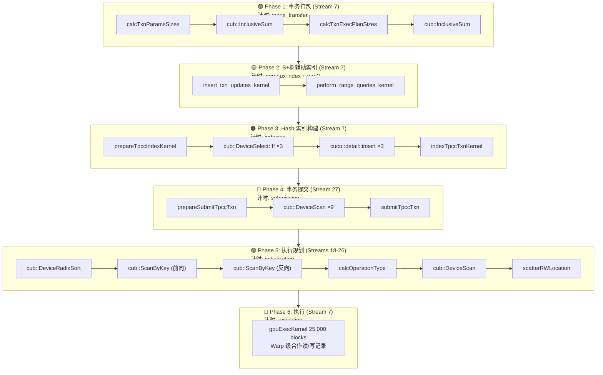

# EPIC：GPU 批量事务处理系统 — 完整指南

> **涵盖范围**：从 `main.cpp` 入口到 `gpuExecKernel` 执行完毕的完整数据流
> **基准配置**：100,000 事务/epoch，1 warehouse，5 epochs，tpccfull mix (45/43/4/4/4)
> **最后更新**：兼容源码截至 2024-04-14

---

## 目录

1. [系统概览](#1-系统概览)
2. [核心数据结构](#2-核心数据结构)
3. [初始化流程（构造期）](#3-初始化流程构造期)
4. [Epoch 流水线全景](#4-epoch-流水线全景)
5. [Phase 1：事务打包](#5-phase-1事务打包)
6. [Phase 2：B+树辅助索引](#6-phase-2b树辅助索引)
7. [Phase 3：Hash 主索引](#7-phase-3hash-主索引)
8. [Phase 4：事务提交](#8-phase-4事务提交)
9. [Phase 5：执行规划](#9-phase-5执行规划)
10. [Phase 6：GPU 执行](#10-phase-6gpu-执行)
11. [五种 TPCC 事务详解](#11-五种-tpcc-事务详解)
12. [存储层：MVCC 版本化读写](#12-存储层mvcc-版本化读写)
13. [事务调度机制](#13-事务调度机制)
14. [性能分析与 NCU Profile](#14-性能分析与-ncu-profile)
15. [推荐阅读路线](#15-推荐阅读路线)
16. [源码快速索引](#16-源码快速索引)

---

## 1. 系统概览

### 1.1 设计哲学

EPIC（Epoch-based Parallel In-situ Coordination）是一个**批量预解析** GPU 事务处理系统。与传统 OLTP 逐个处理事务不同，EPIC 在一个 epoch 开始时将所有事务的完整读写集预先计算出来，然后分六个阶段在 GPU 上流水线执行。

```
传统 OLTP：  事务到达 → 索引查找 → 加锁 → 读写 → 提交 → 下一个事务
EPIC：       [批量预计算读写集] → [GPU 并行执行所有事务]
```

### 1.2 关键设计特点

| 项目 | 说明 |
|------|------|
| **事务模型** | 每 epoch 批量处理 N 个事务（示例：100,000） |
| **读写集** | 在 `gpuExecKernel` 执行前已全部预计算完毕 |
| **索引** | B+Tree（辅助索引）+ Cuco HashMap（主索引），均在事务执行前独立完成 |
| **版本控制** | Record A / Record B / Version 三级 MVCC，warp 级合作读写 |
| **并行粒度** | 每个 Warp（32 线程）合作处理 1 个事务，25,000 个 Warp 同时工作 |
| **无锁设计** | Phase 5 完全确定每个操作的读写位置，Phase 6 无需加锁 |

### 1.3 9 张 TPCC 表

| 表名 | 表大小（1 warehouse） | 操作数示例 | 执行规划 Stream |
|------|:---------------------:|:----------:|:--------------:|
| Warehouse | 2 | 130,961 | Stream 18 |
| District | 20 | 175,940 | Stream 19 |
| Customer | 60,000 | 215,013 | Stream 20 |
| History | —（未实现） | 0 | — |
| New Order | 18,000 | 84,999 | Stream 22 |
| Order | 60,000 | 129,031 | Stream 23 |
| Order Line | 900,000 | 1,292,708 | Stream 24 |
| Item | 100,000 | 448,967 | Stream 25 |
| Stock | 100,000 | 1,688,849 | Stream 26 |

### 1.4 事务混合比例（tpccfull）

| 事务类型 | 占比 | 特点 |
|----------|:---:|------|
| NewOrder | 45% | 读写混合，有循环（每个 item 一次），平均 15 items |
| Payment | 43% | 全读写，无只读操作，3 组固定读写 |
| OrderStatus | 4% | 全只读 |
| Delivery | 4% | 最复杂，10 个 district 各一个独立子事务 |
| StockLevel | 4% | 只读 + 本地计数，最多 380 items |

---

## 2. 核心数据结构

### 2.1 存储层：MVCC 双版本记录

**文件**：`storage.h:18-35`

```cpp
template<typename ValueType>
struct Record {
    uint32_t version1 = 0, version2 = 0;  // 两个版本号
    ValueType value1, value2;              // 两个数据槽位
} __attribute__((aligned(kDeviceCacheLineSize)));  // 128B cache-line 对齐

template<typename ValueType>
struct Version {
    uint32_t version = 0;
    ValueType value;
} __attribute__((aligned(kDeviceCacheLineSize)));
```

**设计要点**：
- `version1` 和 `version2` 在内存中紧邻（`static_assert` 保证），可用 64-bit 原子操作一次读取
- `Record` 提供两个数据槽位，任一时刻至多一个为"当前版本"
- `Version` 数组仅在**同一 record 被多个事务写入**时使用（临时多版本存储）
- History 表因过大未分配（注释掉），所有涉及 History 的操作数为 0

**版本标识常量**（`execution_planner.h:47-48`）：

```cpp
constexpr uint32_t loc_record_a = std::numeric_limits<uint32_t>::max();     // 0xFFFFFFFF
constexpr uint32_t loc_record_b = std::numeric_limits<uint32_t>::max() - 1; // 0xFFFFFFFE
```

当 `read_loc` / `write_loc` 为这些特殊值，表示访问 Record 而非 Version；否则为 Version 数组索引。

### 2.2 表 Schema 定义

**文件**：`benchmarks/tpcc_table.h`

所有表的 Key 使用 **bitfield union** 设计，在 little-endian (x64) 下关键字段按**逆序**排列，使得 `base_key` 可直接用于数值比较。

```cpp
// 例：CustomerKey
union CustomerKey {
    using baseType = ChooseBitfieldBaseType<96'000, 20, 2 * kMaxWarehouses>::type;
    struct {
        baseType c_id    : ceilLog2(96'000);            // 低位
        baseType c_d_id  : ceilLog2(20);
        baseType c_w_id  : ceilLog2(2 * kMaxWarehouses); // 高位
    } key;
    baseType base_key = 0;
};
```

所有 Value 结构体限制在 ≤128 bytes（一个 cache line），通过 `static_assert` 保证。

### 2.3 事务数据三层结构

**文件**：`benchmarks/tpcc_txn.h`

每个事务在流水线中经历三种形态：

```
TxnInput (Phase 1 输入)
  → 包含逻辑键（w_id, d_id, c_id 等），由事务生成器填充
  → 例：NewOrderTxnInput { origin_w_id, d_id, c_id, items[].i_id, ... }

TxnParams (Phase 3 输出)
  → 包含物理 record_id（warehouse_id, district_id, customer_id 等）
  → 例：NewOrderTxnParams { warehouse_id, district_id, items[].item_id, items[].stock_id, ... }

TxnExecPlan (Phase 5 输出)
  → 包含每个操作的读写位置（loc_record_a / loc_record_b / version_index）
  → 例：NewOrderExecPlan { warehouse_loc, district_loc, stock_read_loc, stock_write_loc, ... }
```

**以 NewOrder 为例的完整 TxnParams → TxnExecPlan**：

```cpp
// TxnParams：索引查找后得到
struct NewOrderTxnParams {
    uint32_t warehouse_id;   // record_id
    uint32_t district_id;
    uint32_t customer_id;
    uint32_t new_order_id;
    uint32_t order_id;
    uint32_t num_items;
    uint32_t next_order_id;
    bool     all_local;
    ItemParams items[15];    // 每个 item: {item_id, stock_id, order_line_id, order_quantities}
};

// TxnExecPlan：执行规划后得到
struct NewOrderExecPlan {
    uint32_t warehouse_loc;       // loc_record_a 或 loc_record_b 或 version_index
    uint32_t district_loc;
    uint32_t district_write_loc;
    uint32_t customer_loc;
    uint32_t new_order_loc;
    uint32_t order_loc;
    ItemPlan item_plans[15];      // 每个 item: {item_loc, stock_read_loc, stock_write_loc, orderline_loc}
};
```

### 2.4 操作编码：`op_t`

**文件**：`execution_planner.h:24-38`

```cpp
using op_t = uint64_t;
// 位布局：[record_id: 32bit] [txn_id: 20bit] [r/w: 1bit] [offset: 11bit]
//          [63:32]              [31:12]           [11]         [10:0]
```

`op_t` 是 Phase 4（提交）和 Phase 5（执行规划）之间的核心数据交换格式。通过宏 `CREATE_OP` / `GET_RECORD_ID` / `GET_TXN_ID` / `GET_R_W` / `GET_OFFSET` 操作。

### 2.5 事务数组基础设施

**文件**：`txn.h`, `gpu_txn.cuh`

```
TxnArray<T>          — CPU/GPU 固定大小事务数组
PackedTxnArray<T>    — 变长事务打包数组（每个事务大小可以不同）
GpuPackedTxnArray    — PackedTxnArray 的 GPU 视图，通过 getTxn(idx) 访问
TxnBridge            — CPU↔GPU 数据传输桥
```

`GpuPackedTxnArray` 的关键成员：

```cpp
class GpuPackedTxnArray {
    uint8_t  *txns;     // 连续存储所有事务的 packed buffer
    uint32_t *index;    // index[i] = 事务 i 在 txns 中的偏移
    uint32_t  size;     // 总字节数
    uint32_t  num_txns;

    BaseTxn* getTxn(size_t txn_id) {
        return reinterpret_cast<BaseTxn*>(&txns[index[txn_id]]);
    }
};
```

---

## 3. 初始化流程（构造期）

**入口**：`benchmarks/tpcc.cpp:41` — `TpccDb::TpccDb(TpccConfig config)`

### 3.1 阶段概览

```
main.cpp
  │
  ├── TpccConfig 解析命令行参数
  │
  ├── TpccDb(config) 构造
  │   ├── 创建 TxnArray[epochs]（CPU 端事务数组）
  │   ├── 创建 5 个桥接管道（TxnBridge ×5）
  │   ├── 创建 GPU Index（TpccGpuIndex）
  │   ├── 创建 9 个 GpuTableExecutionPlanner（每个表一个）
  │   ├── 创建 TpccGpuSubmitter（绑定所有表的 planner）
  │   ├── 分配所有表的 Record & Version GPU 内存
  │   └── 创建 GpuExecutor
  │
  ├── loadInitialData()  → 加载 TPCC 初始数据
  ├── generateTxns()     → 生成所有 epoch 的事务输入
  └── runBenchmark()     → 逐 epoch 执行 6 阶段流水线
```

### 3.2 数据桥接管道

**文件**：`benchmarks/tpcc.cpp:65-69`

```cpp
input_index_bridge.Link(txn_array[0], index_input);
// CPU TxnInput → GPU index_input

index_initialization_bridge.Link(index_output, initialization_input);
// GPU index_output → GPU initialization_input（GPU 内部拷贝）

index_execution_param_bridge.Link(index_output, execution_param_input);
// GPU index_output → GPU execution_param_input（GPU 内部拷贝）

initialization_execution_plan_bridge.Link(initialization_output, execution_plan_input);
// GPU initialization_output → GPU execution_plan_input（GPU 内部拷贝）
```

跨设备（CPU↔GPU）时 `TxnBridge::StartTransfer()` 执行 `cudaMemcpy`；同设备（GPU↔GPU）时直接共享指针。

### 3.3 9 个执行规划器初始化

**文件**：`benchmarks/tpcc.cpp:71-102`

每个 `GpuTableExecutionPlanner` 的构造参数：

```cpp
GpuTableExecutionPlanner(
    name,              // 表名（用于日志）
    allocator,         // GPU 内存分配器
    record_size,       // 当前未使用
    max_ops_per_txn,   // 每个事务对该表的最大操作数
    max_num_txns,
    max_num_records,
    txn_array          // 关联的 TxnExecPlanArray
);
```

`Initialize()` 分配的内部数组（`gpu_execution_planner.cu:40-80`）：

| 数组 | 大小 | 用途 |
|------|------|------|
| `d_num_ops` | `max_num_txns × 4B` | 每个事务对该表的操作数 |
| `d_op_offsets` | `max_num_txns × 4B` | 前缀和偏移 |
| `d_submitted_ops` | `max_num_ops × 8B` | 提交的 `op_t` 数组（输入） |
| `d_sorted_ops` | `max_num_ops × 8B` | 按 record_id 排序后的 `op_t` |
| `d_write_ops_before` | `max_num_ops × 4B` | 每个操作之前有几个写 |
| `d_write_ops_after` | `max_num_ops × 4B` | 每个操作之后有几个写 |
| `d_rw_ops_type` | `max_num_ops × 1B` | 操作类型（`OperationT` 枚举） |
| `d_tver_write_ops_before` | `max_num_ops × 4B` | Version write 的索引 |
| `d_rw_locations` | `max_num_ops × 4B` | 最终读写位置 |
| `d_scratch_array` | `max(4×max_num_ops×8B, 2048)` | CUB 排序/扫描临时空间 |

### 3.4 Record & Version 内存分配

**文件**：`benchmarks/tpcc.cpp:138-238`

以 1 warehouse 为例（近似值）：

| 表 | Record 大小 | Version 大小 |
|------|-----------|-------------|
| Warehouse | 2×128B = 256B | 100K×128B ≈ 12.8MB |
| District | 20×128B = 2.5KB | 100K×128B ≈ 12.8MB |
| Customer | 60K×128B ≈ 7.68MB | 100K×128B ≈ 12.8MB |
| New Order | 18K×128B ≈ 2.3MB | 100K×128B ≈ 12.8MB |
| Order | 60K×128B ≈ 7.68MB | 100K×128B ≈ 12.8MB |
| Order Line | 900K×128B ≈ 115MB | 100K×15×128B ≈ 192MB |
| Item | 100K×128B ≈ 12.8MB | 100K×15×128B ≈ 192MB |
| Stock | 100K×128B ≈ 12.8MB | 100K×15×128B ≈ 192MB |

> **注意**：Version 数组大小关键影响内存占用，过小会导致同步问题。Order Line / Item / Stock 的 Version 数组 ×15 是因为同一 record 可能被多个事务的多个 item 同时写入。

---

## 4. Epoch 流水线全景

**入口**：`benchmarks/tpcc.cpp:338` — `TpccDb::runBenchmark()`

每个 epoch 内部按顺序执行以下 6 个阶段：



### 4.1 流水线时间线（100K txns, 1 warehouse, Epoch 5）

```
时间轴 (μs)
0        5,000     10,000    15,000    20,000                                        85,000

├── P1 ──┤├─P2─┤├─── P3 ───┤├P4┤├── P5 ──┤├────────── Phase 6: gpuExecKernel ─────────────────┤
│transfer││aux ││ indexing  ││sub││ init   ││                                                │
│1,046μs ││1775││ 2,237μs   ││802││ 1,512μs││              62,867μs                          │
└────────┴┴────┴┴───────────┴┴───┴┴────────┘└────────────────────────────────────────────────┘
                                                                        ↑
                                                       cudaDeviceSynchronize() 在此等待

总计端到端: 70,239 μs ≈ 70.2 ms
Phase 6 占比: 89.5%
```

> **关键时序**：Phase 2–5 的 GPU kernel 在 Phase 6 `execution` 开始前已通过 `FinishInitialization()` 中的 `cudaStreamSynchronize` 全部完成。`execution` 计时**仅包含** Phase 6 的 `gpuExecKernel`。

---

## 5. Phase 1：事务打包

**计时标签**：`index_transfer`
**源文件**：`benchmarks/tpcc_gpu_txn.cu`
**CUB 依赖**：`cub::DeviceScan::InclusiveSum`

### 5.1 包含操作

1. `input_index_bridge.StartTransfer()` / `FinishTransfer()` — CPU→GPU 数据传输
2. `buildPackedTxnArrayGpu(index_input, index_output)` — 构建 TxnParams packed array
3. `buildPackedTxnArrayGpu(index_input, initialization_output)` — 构建 TxnExecPlan packed array

### 5.2 GPU Kernel 流程

```
calcTxnParamsSizes <<<196, 512>>>
  ↓ 每个线程根据 txn_type 查表得到事务参数大小
cub::DeviceScan::InclusiveSum
  ↓ 前缀和 → 得到每个事务在 PackedArray 中的 offset
calcTxnExecPlanSizes <<<196, 512>>>
  ↓ 同理计算每个事务的 ExecutionPlan 大小
cub::DeviceScan::InclusiveSum
  ↓ 前缀和 → 得到执行计划的 offset
```

`GpuPackedTxnArray` 构建完成后，所有事务以紧凑格式存储在 GPU 连续内存中，每个事务可通过 `getTxn(idx)` O(1) 访问。

---

## 6. Phase 2：B+树辅助索引

**计时标签**：`gpu aux index` + `gpu aux index part2`
**源文件**：`benchmarks/tpcc_gpu_aux_index.cu`
**目的**：为 OrderStatus、Delivery、StockLevel 提供 `(warehouse, district, customer) → order` 的 B+Tree 查找

### 6.1 第 1 部分 — 插入

```
insert_txn_updates_kernel <<<196, 512>>>
  对每个 NewOrder 事务:
    构造 PackedCustomerOrderKey{w_id, d_id, c_id, max_o_id - o_id}
    ↓
    B+Tree cooperative_insert (Tile 级合作, 16 线程/tile)
  同时缓存:
    ├─ order_num_items[]       — 每个订单的 item 数量
    ├─ order_customers[]       — 每个订单的 customer_id
    └─ order_items[][15]       — 每个订单的 item 列表
```

### 6.2 第 2 部分 — 范围查询

```
perform_range_queries_kernel <<<196, 512>>>
  对每种事务:
    ├─ OrderStatus: B+Tree.find_next 查找用户最近订单
    ├─ Delivery:    遍历 10 个 district，获取每区订单详情
    └─ StockLevel:  扫描最近 20 个订单的 items，WarpMergeSort 去重排序
```

B+Tree 的 Tile 级合作插入和范围查询使其在 GPU 上具有高吞吐。

---

## 7. Phase 3：Hash 主索引

**计时标签**：`indexing`
**源文件**：`benchmarks/tpcc_gpu_index.cu`
**目的**：将 TxnInput 的逻辑键转换为 TxnParams 的物理 record_id

### 7.1 流水线

```
prepareTpccIndexKernel <<<196, 512>>>
  ↓ 对每种事务类型准备复合 key (OrderKey, NewOrderKey, OrderLineKey)
  ↓ 非 NewOrder 事务填充 -1 表示不需要索引
cub::DeviceSelect::If ×3
  ↓ 分别过滤出 ORDER_INSERT / NEW_ORDER_INSERT / ORDER_LINE_INSERT 操作
cuco::detail::insert ×3 <<<N, 128>>>
  ↓ 插入 3 张 cuco static_map 哈希表 (O(1) 查找)
indexTpccTxnKernel <<<196, 512>>>
  ↓ 构建最终 tpccGpuIndexFindView (供 gpuExecKernel 中的索引查找使用)
```

### 7.2 索引表

| 哈希表 | Key 类型 | 用途 |
|--------|---------|------|
| Order Index | `(o_w_id, o_d_id, o_id)` | NewOrder / Payment / OrderStatus 的订单查找 |
| New Order Index | `(no_w_id, no_d_id, no_o_id)` | Delivery 的 new_order 查找 |
| Order Line Index | `(ol_w_id, ol_d_id, ol_o_id, ol_number)` | NewOrder 的 order_line 插入位置查找 |

cuco static_map 使用开放寻址，GPU 友好的 O(1) 平均查找时间。

---

## 8. Phase 4：事务提交

**计时标签**：`submission`
**源文件**：`benchmarks/tpcc_gpu_submitter.cu`
**CUB 依赖**：`cub::DeviceScan::ExclusiveSum` ×9

### 8.1 流水线

```
prepareSubmitTpccTxn <<<98, 1024>>>  (Stream 27)
  ↓ 每个线程处理一个事务，计算该事务对各表的操作数
  ↓ 例：NewOrder → warehouse=1, district=2, customer=1, order=1,
  ↓              new_order=1, order_line=num_items, item=num_items, stock=num_items×2
  ↓ 写入各表的 d_num_ops 数组
cub::DeviceScan ×9
  ↓ 每个表独立计算前缀和 → d_op_offsets
submitTpccTxn <<<98, 1024>>>  (Stream 27)
  ↓ 每个事务根据 d_op_offsets 将操作 scatter 到各表的 d_submitted_ops
  ↓ 每个操作编码为 op_t：record_id | txn_id | r/w | offset
```

### 8.2 各事务类型的操作数

| 事务类型 | W | D | C | H | O | NO | OL | I | S |
|----------|:-:|:-:|:-:|:-:|:-:|:-:|:-:|:-:|:-:|
| NewOrder | 1 | 2 | 1 | 0 | 1 | 1 | n | n | 2n |
| Payment | 2 | 2 | 2 | 0 | 0 | 0 | 0 | 0 | 0 |
| OrderStatus | 0 | 0 | 1 | 0 | 1 | 0 | n | 0 | 0 |
| Delivery | 0 | 0 | 2×10 | 0 | 2×10 | 1×10 | 2×n | 0 | 0 |
| StockLevel | 0 | 0 | 0 | 0 | 0 | 0 | 0 | 0 | n |

> `n` = 事务的 item 数量

---

## 9. Phase 5：执行规划 ⭐

**计时标签**：`initialization`
**源文件**：`gpu_execution_planner.cu`
**CUB 依赖**：`cub::DeviceRadixSort`, `cub::DeviceScan::ExclusiveSumByKey` ×2, `cub::DeviceScan::ExclusiveSum`

这是 EPIC **最核心的创新**：在事务执行前，确定每个操作的精确读写位置（Record A / Record B / Version），消除执行阶段的锁竞争。

### 9.1 9 表并行流水线

9 个表各自在独立的 CUDA Stream（18-26）中执行完全相同的 6 步流水线：

```
① cub::DeviceRadixSort
   按 record_id 排序所有 op_t（同 record 的操作聚在一起）

② cub::DeviceScan::ExclusiveSumByKey (前向)
   统计每个操作之前有几个写操作 → d_write_ops_before

③ cub::DeviceScan::ExclusiveSumByKey (反向, 使用 ReverseIterator)
   统计每个操作之后有几个写操作 → d_write_ops_after

④ calcOperationType <<<(n_ops+255)/256, 256>>>
   根据 w_before / w_after 分类操作类型

⑤ cub::DeviceScan::ExclusiveSum (version write)
   统计每个 Version write 之前有几个 Version write → d_tver_write_ops_before

⑥ scatterRWLocation <<<(n_ops+255)/256, 256>>>
   将最终读写位置写入各事务的 TxnExecPlan
```

### 9.2 操作类型判定规则

**`calcOperationType` kernel**（`gpu_execution_planner.cu:110-140`）：

```
对每个操作:
  if 是写操作:
      if w_after == 0:  → RECORD_B_WRITE  (该 record 的最后一个写，写 Record B)
      else:             → VERSION_WRITE    (该 record 还有后续写，写临时 Version)
  else (读操作):
      if w_before == 0:                   → RECORD_A_READ   (没有前置写，读 epoch 前版本)
      else if w_after == 0:               → RECORD_B_READ   (最后一个写之后，读 Record B)
      else:                               → VERSION_READ    (中间版本，读对应的 Version)
```

### 9.3 读写位置映射

**`scatterRWLocation` kernel**（`gpu_execution_planner.cu:145-185`）：

```
RECORD_A_READ / RECORD_A_WRITE → loc_record_a (0xFFFFFFFF)
RECORD_B_READ / RECORD_B_WRITE → loc_record_b (0xFFFFFFFE)
VERSION_READ                   → ver_writes_before - 1
VERSION_WRITE                  → ver_writes_before
```

最终写入 `TxnExecPlan` 的对应字段。例如 NewOrder 的 `warehouse_loc` 将被设为以上三个值之一。

### 9.4 示例：同一 Stock Record 被 3 个事务写

```
epoch=5 时，Stock[s_id=100] 被 txn_A, txn_B, txn_C 写入

提交的 ops（按 txn_id 顺序）：
  txn_A: write stock_id=100
  txn_B: read  stock_id=100
  txn_C: write stock_id=100

排序后（同 record 聚在一起）：
  ① txn_A write  →  w_before=0, w_after=1  → RECORD_B_WRITE → loc_record_b
  ② txn_B read   →  w_before=1, w_after=0  → RECORD_B_READ  → loc_record_b
  ③ txn_C write  →  w_before=1, w_after=0  → RECORD_B_WRITE → loc_record_b

等等不对！两个写操作都映射到 RECORD_B_WRITE？只有一个 Record B slot。

实际执行：
  txn_A: write value1 (选 ver 较小的 slot), set version1=epoch
  txn_B: read  version1==epoch → 读 value1
  txn_C: write 会使用 Version[0]（因为 w_after=0? 不对，w_after 是看"之后"有几个写）

正确分析（按 record_id 排序后的顺序）：
  ① txn_C write  →  w_before=0, w_after=1  → VERSION_WRITE  → ver_writes_before=0
  ② txn_A write  →  w_before=1, w_after=1  → VERSION_WRITE  → ver_writes_before=1
  ③ txn_B read   →  w_before=2, w_after=0  → RECORD_B_READ  → loc_record_b

不对，还需要看实际顺序。关键是：
  - 按 record_id 排序后，顺序是任意的（不保证 txn_id 顺序）
  - 第一个写操作 → RECORD_B_WRITE（w_after>0? 不，第一个写没有前置写，最后一个写没有后置写）
```

**正确规则**（简化为三类情况）：

```
同一 record 上:
  1 个写 + 0 个读: 写 → RECORD_B_WRITE
  1 个写 + n 个读: 写 → RECORD_B_WRITE,  读 → RECORD_B_READ（自旋等待写完成）
  m 个写 + n 个读:
    第一个写 → RECORD_B_WRITE (w_before=0)
    中间写   → VERSION_WRITE  (w_before>0, w_after>0)
    最后一个写 → VERSION_WRITE 或 RECORD_B_WRITE (w_after=0)
    读在第一个写之前 → RECORD_A_READ (w_before=0)
    读在最后一个写之后 → RECORD_B_READ (w_after=0)
    读在中间 → VERSION_READ
```

**关键不变量**：Record B 的写入者负责 `atomicExch(version, epoch)` 发布版本号；Record B 的读者和 Version 的读者通过自旋等待 `while(version != epoch) {}` 来同步。

### 9.5 `FinishInitialization()`

**文件**：`gpu_execution_planner.cu:287-340`

```cpp
void FinishInitialization() {
    if (curr_num_ops == 0) return;
    cudaStreamSynchronize(cuda_stream);  // 等待该表的所有 kernel 完成
}
```

在 `benchmarks/tpcc.cpp:474-500` 中，9 个表的 `InitializeExecutionPlan()` 依次**异步**启动，然后 `FinishInitialization()` 依次**同步**等待。由于每个表使用独立的 stream，它们可以并行执行。

---

## 10. Phase 6：GPU 执行 ⭐

**计时标签**：`execution`
**源文件**：`benchmarks/tpcc_gpu_executor.cu`

### 10.1 `GpuExecutor::execute()`

**文件**：`benchmarks/tpcc_gpu_executor.cu:390-439`

```cpp
void GpuExecutor::execute(uint32_t epoch) {
    // Step 1: 清零全局事务计数器
    cudaMemcpyToSymbol(txn_counter, &zero, sizeof(uint32_t));

    // Step 2: 计算 block 数
    // num_blocks = ceil(num_txns × warp_size / block_size)
    //            = ceil(100000 × 32 / 128) = 25,000
    uint32_t num_blocks = (config.num_txns * kDeviceWarpSize + block_size - 1) / block_size;

    // Step 3: Launch kernel
    gpuExecKernel<<<num_blocks, block_size>>>(
        records, versions, txn, plan, config.num_txns, epoch);

    // Step 4: 等待完成
    cudaDeviceSynchronize();  // ← 62ms 主要在此
}
```

### 10.2 Kernel 启动配置

| 参数 | 值 | 计算 |
|------|---|------|
| `block_size` | 128 | 编译期常量 |
| `num_warps` | 4 | = 128 / 32 |
| `num_blocks` | 25,000 | = ceil(100,000 × 32 / 128) |
| 总 threads | 3,200,000 | = 25,000 × 128 |
| 总 warps | 100,000 | = 25,000 × 4 |
| Shared memory/block | ~4 KB | 4×(CachableTxnParams + CachableTxnExecPlan) + 4B |

### 10.3 gpuExecKernel 主循环

**文件**：`benchmarks/tpcc_gpu_executor.cu`（匿名命名空间）

```
__global__ void gpuExecKernel(records, versions, txn, plan, num_txns, epoch):

    __shared__ uint8_t cached_txn_param[4][sizeof(CachableTxnParams)];
    __shared__ uint8_t cached_exec_plan[4][sizeof(CachableTxnExecPlan)];
    __shared__ uint32_t warp_counter;

    warp_id = threadIdx.x / 32
    lane_id = threadIdx.x % 32

    // [调度] 两级 atomicAdd
    if thread 0:
        warp_counter = atomicAdd(&txn_counter, 4)   // 全局抢 4 个 warp 的事务槽
    __syncthreads()
    if lane 0:
        warp_txn_id = atomicAdd(&warp_counter, 1)    // block 内抢 1 个事务
    warp_txn_id = __shfl(warp_txn_id, 0)             // broadcast

    if warp_txn_id >= num_txns: return

    // [加载] warpMemcpy 并行拷贝到 shared memory
    // [执行] 按 txn_type 分发
    switch txn_type:
        NEW_ORDER    → gpuExecTpccTxn(NewOrder...)
        PAYMENT      → gpuExecTpccTxn(Payment...)
        ORDER_STATUS → gpuExecTpccTxn(OrderStatus...)
        DELIVERY     → gpuExecTpccTxn(Delivery...)
        STOCK_LEVEL  → gpuExecTpccTxn(StockLevel...)
```

### 10.4 Shared Memory 缓存策略

| 事务类型 | 使用 shared memory? | 原因 |
|----------|:---:|------|
| NewOrder | ✅ | 拟合 `CachableTxnParams` union |
| Payment | ✅ | 拟合 `CachableTxnParams` union |
| OrderStatus | ✅ | 拟合 `CachableTxnParams` union |
| Delivery | ❌ | 含变长数组 `num_items[10]` + `orderline_ids[10][n]` |
| StockLevel | ❌ | 含变长数组 `stock_ids[n]`（n 可达 380） |

---

## 11. 五种 TPCC 事务详解

所有事务执行函数均定义在 `benchmarks/tpcc_gpu_executor.cu` 匿名命名空间中。

### 11.1 NewOrder（45%）

```cpp
__device__ void gpuExecTpccTxn(records, versions,
    NewOrderTxnParams *params, NewOrderExecPlan *plan, epoch, lane_id, txn_id)
```

**操作序列**：

```
第 1 阶段：固定操作
┌──────────────────────────────────────────────────────┐
│ 1. Read  Warehouse    (warehouse_record,  warehouse_loc)  │
│ 2. Read  District     (district_record,   district_loc)   │
│    └─ lane[d_next_o_id_offset]: result = params->next_order_id
│ 3. Write District     (district_record,   district_write_loc)
│ 4. Read  Customer     (customer_record,   customer_loc)
│ 5. Write Order        (order_record,      order_loc)       │
│ 6. Write NewOrder     (new_order_record,  new_order_loc)   │
└──────────────────────────────────────────────────────┘

第 2 阶段：对每个 item 循环
┌──────────────────────────────────────────────────────┐
│ for i in 0..params->num_items:                        │
│   7. Read  Item       (item_record,  item_loc)        │
│   8. Read  Stock      (stock_record, stock_read_loc)  │
│      └─ lane[s_quantity_offset]:                      │
│           result = result > qty+10 ? result-qty       │
│                                    : result+91-qty    │
│   9. Write Stock      (stock_record, stock_write_loc) │
│  10. Write OrderLine  (orderline_record, orderline_loc)│
│      └─ lane[ol_i_id]:        result = item_id         │
│      └─ lane[ol_amount]:      result = order_quantities│
│      └─ lane[ol_supply_w_id]: result = warehouse_id    │
│      └─ lane[ol_quantity]:    result = order_quantities│
└──────────────────────────────────────────────────────┘
```

**总操作数**：6 + 4 × num_items（典型 ≈15 → 66 次存储操作）

**关键编译期偏移**：

```cpp
constexpr uint32_t s_quantity_offset    = offsetof(StockValue, s_quantity) / 4;
constexpr uint32_t d_next_o_id_offset   = offsetof(DistrictValue, d_next_o_id) / 4;
constexpr uint32_t ol_i_id_offset       = offsetof(OrderLineValue, ol_i_id) / 4;
constexpr uint32_t ol_amount_offset     = offsetof(OrderLineValue, ol_amount) / 4;
constexpr uint32_t ol_supply_w_id_offset = offsetof(OrderLineValue, ol_supply_w_id) / 4;
constexpr uint32_t ol_quantity_offset   = offsetof(OrderLineValue, ol_quantity) / 4;
```

### 11.2 Payment（43%）

```cpp
__device__ void gpuExecTpccTxn(records, versions,
    PaymentTxnParams *params, PaymentTxnExecPlan *plan, epoch, lane_id, txn_id)
```

```
1. Read  Warehouse  → lane[w_ytd_offset]:        result += payment_amount
2. Write Warehouse
3. Read  District   → lane[d_ytd_offset]:        result += payment_amount
4. Write District
5. Read  Customer   → lane[c_balance_offset]:     result -= payment_amount
                    → lane[c_ytd_payment_offset]: result += payment_amount
                    → lane[c_payment_cnt_offset]: result += 1
6. Write Customer
```

**总操作数**：6（3 组读写，无循环）

### 11.3 OrderStatus（4%）

```cpp
__device__ void gpuExecTpccTxn(records, versions,
    OrderStatusTxnParams *params, OrderStatusTxnExecPlan *plan, epoch, lane_id, txn_id)
```

全只读，无写操作：

```
1. Read Customer
2. Read Order
3. for i in 0..num_items:
     Read OrderLine
```

### 11.4 Delivery（4%）

最复杂的事务类型，10 个 district 各一个独立子事务：

```
for i in 0..9 (10 districts):
    1. Read  NewOrder  (new_order_record, new_order_read_locs[i])
    2. Read  Order     (order_record,      order_read_locs[i])
       └─ lane[o_carrier_id]: result = params->carrier_id
    3. Write Order     (order_record,      order_write_locs[i])
    4. for j in 0..params->num_items[i]:
         Read  OrderLine (orderline_record, orderline_read_locs[i][j])
         └─ lane[ol_amount]: amount += result
         └─ lane[ol_delivery_d]: result = params->delivery_d
         Write OrderLine (固定使用 loc_record_b)
    5. __shfl_sync 广播 amount 到所有 lane
    6. Read  Customer (customer_record, customer_read_locs[i])
       └─ lane[c_balance]: result += amount
       └─ lane[c_delivery_cnt]: ++result
    7. Write Customer (customer_record, customer_write_locs[i])
```

**特殊之处**：
- 不使用 shared memory 缓存（参数过大，含变长数组 `num_items[10]` 和 `orderline_ids[10][15]`）
- OrderLine 的 Write **固定使用 `loc_record_b`**（硬编码，不走 Version）
- `amount` 通过 `__shfl_sync` 跨 lane 广播——只有 `ol_amount_offset` lane 知道 amount，但所有 lane 需要它来更新 `c_balance`

### 11.5 StockLevel（4%）

```
num_low_stock = 0
for i in 0..num_items (最多 380):
    Read Stock
    if lane[s_quantity_offset] and result < threshold:
        num_low_stock++
params->num_low_stock = num_low_stock
```

仅 lane 0 负责 `num_low_stock` 计数和最终赋值。

---

## 12. 存储层：MVCC 版本化读写

**源文件**：`gpu_storage.cuh`

所有表操作通过两个模板函数实现，Warp 内 32 线程合作完成。

### 12.1 `gpuReadFromTableCoop()`

```cpp
template<typename ValueType>
__device__ void gpuReadFromTableCoop(
    Record<ValueType> *record,
    Version<ValueType> *version,
    uint32_t record_id,
    uint32_t read_loc,       // loc_record_a / loc_record_b / version_index
    uint32_t epoch,
    uint32_t &result,        // 输出：lane_id 对应字段的值
    uint32_t lane_id)
```

**Leader lane（lane 0）决策逻辑**：

```
if read_loc == loc_record_a:
    // 读取 epoch 开始时的最新版本
    64-bit 原子读 version1 和 version2
    if version1 == epoch:     → 读 value2  (value1 是本 epoch 的 record_b)
    elif version2 == epoch:   → 读 value1  (value2 是本 epoch 的 record_b)
    elif version1 < version2: → 读 value2  (version2 是 epoch 前的最新版)
    else:                     → 读 value1  (version1 是 epoch 前的最新版)

elif read_loc == loc_record_b:
    // 读取本 epoch 的第一个写入版本
    64-bit 原子读 version1 和 version2
    if version1 == epoch:     → 读 value1
    elif version2 == epoch:   → 读 value2
    elif version1 < version2: → 读 value1（将在此 epoch 被写入）
                                while(version1 != epoch) {}  // 自旋等待
    else:                     → 读 value2（将在此 epoch 被写入）
                                while(version2 != epoch) {}  // 自旋等待

else:
    // 读取临时 Version
    value_to_read = &version[read_loc].value
    while(version[read_loc].version != epoch) {}  // 自旋等待
```

**所有 lane 并行读取**：

```
value_ptr = __shfl_sync(all_lanes_mask, value_to_read, 0)  // 广播指针
for base in 0..length step 32:
    if lane_id + base < length:
        result += reinterpret_cast<uint32_t*>(value_ptr)[offset + base + lane_id]
```

每个 lane 负责读取 Value 中的一个 32-bit 字段。对于 128B 的 Value（32 个 uint32_t），正好每个 lane 读 1 个字段。

### 12.2 `gpuWriteToTableCoop()`

```cpp
template<typename ValueType>
__device__ void gpuWriteToTableCoop(
    Record<ValueType> *record,
    Version<ValueType> *version,
    uint32_t record_id,
    uint32_t write_loc,
    uint32_t epoch,
    uint32_t data,           // lane_id 对应字段的值
    uint32_t lane_id)
```

**Leader lane 决策**：

```
if write_loc == loc_record_b:
    64-bit 原子读 version1 和 version2
    if version1 < version2:  → 写 value1, 更新 version1
    else:                    → 写 value2, 更新 version2

else:  // version write
    value_to_write = &version[write_loc].value
```

**所有 lane 并行写入**：

```
value_ptr = __shfl_sync(...)  // 广播指针
reinterpret_cast<uint32_t*>(value_ptr)[offset + lane_id] = data

__threadfence()   // 确保写入对所有线程可见
__syncwarp()      // Warp 内同步

// 只有 leader lane 发布版本号
if lane_id == 0:
    atomicExch(version_to_update, epoch)  // 发布版本号
```

**关键点**：先用 `__threadfence()` + `__syncwarp()` 确保所有 lane 的数据写入完成，然后 leader lane 通过 `atomicExch` 发布版本号。版本号就是写完成的信号——读者通过 `while(version != epoch) {}` 自旋等待版本号。

---

## 13. 事务调度机制

### 13.1 两级原子计数器

```
全局（device memory）:
  __device__ uint32_t txn_counter = 0;
  ↓ atomicAdd(&txn_counter, 4)   ← 每个 block 的 thread 0 执行一次
  ↓ 一次抢 4 个 warp 的事务槽位

Block 内（shared memory）:
  __shared__ uint32_t warp_counter;
  ↓ atomicAdd(&warp_counter, 1)  ← 每个 warp 的 lane 0 执行
  ↓ 返回该 warp 要处理的事务 id
```

### 13.2 调度示例

```
时间 →
Block 0:  txn_counter 0→4   → warp0:txn0  warp1:txn1  warp2:txn2  warp3:txn3
Block 1:  txn_counter 4→8   → warp0:txn4  warp1:txn5  warp2:txn6  warp3:txn7
Block 2:  txn_counter 8→12  → warp0:txn8  warp1:txn9  ...
...
Block N-1: ... → 100,000 个事务全部分配完毕
```

- 25,000 blocks × 4 warps/block = 100,000 warps = 100,000 个事务
- 每个 warp 独立处理 1 个事务
- 如果 num_txns 不能被 num_warps 整除，多余的 warp 在 `warp_txn_id >= num_txns` 时提前 return

### 13.3 Block 数计算公式

```cpp
num_blocks = (num_txns * kDeviceWarpSize + block_size - 1) / block_size;
//         = (100000 * 32 + 127) / 128
//         = 3,200,000 / 128 = 25,000
```

---

## 14. 性能分析与 NCU Profile

### 14.1 各 Phase 耗时

| 阶段 | 耗时 (μs) | 占比 |
|------|----------:|-----:|
| cpu aux index | 0 | 0.0% |
| index_transfer | 1,046 | 1.5% |
| gpu aux index | 1,113 | 1.6% |
| gpu aux index part2 | 662 | 0.9% |
| indexing | 2,237 | 3.2% |
| submission | 802 | 1.1% |
| initialization | 1,512 | 2.2% |
| **execution** | **62,867** | **89.5%** |
| **总计** | **70,239** | 100% |

### 14.2 吞吐量计算

```python
# 端到端 tps
total_us = 1046 + 1113 + 662 + 2237 + 802 + 1512 + 62867  # = 70,239
tps = 100_000 / (70_239 / 1_000_000) ≈ 1,423,000

# 纯执行 tps
exec_tps = 100_000 / (62_867 / 1_000_000) ≈ 1,590,000
```

> **注意**：这是 batch 模式下的等效 tps。EPIC 与标准 TPCC 在事务到达模型、读写集计算时机、索引查找时机上都有本质差异，不能直接与 tpmC 对比。论文中建议同时报告端到端时间（含 Phase 1-6）和纯 execution 时间。

### 14.3 EPIC vs 标准 TPCC 差异

| 维度 | 标准 TPCC | EPIC |
|------|----------|------|
| 事务到达 | 实时、逐个 | 批量预生成 |
| 读写集 | 执行时动态计算 | 执行前全预计算（Phase 1-5） |
| 索引查找 | 事务内进行 | 独立于事务（Phase 2-3） |
| 锁/版本 | 事务内获取 | Phase 5 完全确定读写位置，Phase 6 无锁 |
| 事务隔离 | 串行化 | Epoch 内并行（MVCC 版本链保证正确性） |

### 14.4 重点 Kernel 总结

| 优先级 | Kernel | Block 数 | 耗时特征 | 源文件 |
|:------:|--------|:--------:|----------|--------|
| ⭐⭐⭐ | `gpuExecKernel` | 25,000 | **62.9 ms (89%)** | `tpcc_gpu_executor.cu` |
| ⭐⭐⭐ | `calcOperationType` | 500–6,600 | 每表一次 | `gpu_execution_planner.cu` |
| ⭐⭐⭐ | `scatterRWLocation` | 500–6,600 | 每表一次 | `gpu_execution_planner.cu` |
| ⭐⭐ | `insert_txn_updates_kernel` | 196 | B+Tree 插入 | `tpcc_gpu_aux_index.cu` |
| ⭐⭐ | `perform_range_queries_kernel` | 196 | B+Tree 范围查询 | `tpcc_gpu_aux_index.cu` |
| ⭐⭐ | `indexTpccTxnKernel` | 196 | 构建 Hash 查找视图 | `tpcc_gpu_index.cu` |
| ⭐ | `prepareTpccIndexKernel` | 196 | 准备索引 key | `tpcc_gpu_index.cu` |
| ⭐ | `submitTpccTxn` | 98 | 事务提交 | `tpcc_gpu_submitter.cu` |
| ⭐ | `prepareSubmitTpccTxn` | 98 | 准备提交 | `tpcc_gpu_submitter.cu` |
| ⭐ | `calcTxnParamsSizes` | 196 | 计算参数大小 | `tpcc_gpu_txn.cu` |
| ⭐ | `calcTxnExecPlanSizes` | 196 | 计算执行计划大小 | `tpcc_gpu_txn.cu` |

### 14.5 NCU Profile 命令

```bash
ncu --set full --target-processes all \
  --kernel-name base:gpuExecKernel \
  --kernel-name base:calcOperationType \
  --kernel-name base:scatterRWLocation \
  --kernel-name base:insert_txn_updates_kernel \
  --kernel-name base:perform_range_queries_kernel \
  --kernel-name base:prepareTpccIndexKernel \
  --kernel-name base:indexTpccTxnKernel \
  --kernel-name base:submitTpccTxn \
  --kernel-name base:prepareSubmitTpccTxn \
  --kernel-name base:calcTxnParamsSizes \
  --kernel-name base:calcTxnExecPlanSizes \
  -f -o epic_profile/test \
  ./build/epic_driver -b tpccfull -d epic -w 1 -e 5 -s 100000 -x gpu
```

---

## 15. 推荐阅读路线

### 15.1 第一遍：理解数据结构

```
txn.h
  └─ BaseTxn, TxnArray<T>, BaseTxnSize<T>

storage.h
  └─ Record<ValueType> (双版本), Version<ValueType>

benchmarks/tpcc_table.h
  └─ 9 张表的 Key/Value union/struct, bitfield 设计

benchmarks/tpcc_storage.h
  └─ TpccRecords, TpccVersions (9 张表的指针集合)

benchmarks/tpcc_txn.h
  └─ TxnInput → TxnParams → TxnExecPlan 三层结构
  └─ 五种事务类型各自的 Input/Params/ExecPlan
```

### 15.2 第二遍：理解初始化流程

```
main.cpp
  └─ 命令行参数解析 → TpccConfig

benchmarks/tpcc.cpp (构造函数, L41-238)
  └─ TxnBridge 管道的建立
  └─ GpuTableExecutionPlanner ×9 的创建与 Initialize()
  └─ TpccGpuSubmitter 的创建
  └─ Record & Version 内存分配

execution_planner.h
  └─ op_t 编码格式, OperationT 枚举

gpu_execution_planner.h
  └─ GpuTableExecutionPlanner 模板类声明

gpu_execution_planner.cu (Initialize, L40-80)
  └─ GPU 内部数组的分配
```

### 15.3 第三遍：理解运行流程

```
benchmarks/tpcc.cpp (runBenchmark, L338-630)
  └─ 逐 epoch 循环，7 个子阶段的时间测量

benchmarks/tpcc_gpu_index.cu
  └─ Phase 3: prepareTpccIndexKernel → cuco::insert ×3 → indexTpccTxnKernel

benchmarks/tpcc_gpu_submitter.cu
  └─ Phase 4: prepareSubmitTpccTxn → cub::DeviceScan ×9 → submitTpccTxn
```

### 15.4 第四遍：理解核心创新

```
gpu_execution_planner.cu (InitializeExecutionPlan, L196-285)
  └─ Phase 5: 6 步流水线（排序 → 前向扫描 → 反向扫描 → 分类 → 版本扫描 → 散射）
  └─ calcOperationType kernel
  └─ scatterRWLocation kernel

gpu_storage.cuh
  └─ gpuReadFromTableCoop: leader lane 决策 + 32 lane 并行读取
  └─ gpuWriteToTableCoop: 32 lane 并行写入 + leader lane 发布版本号

benchmarks/tpcc_gpu_executor.cu
  └─ Phase 6: gpuExecKernel 主循环 + 调度
  └─ gpuExecTpccTxn ×5 重载 (NewOrder / Payment / OrderStatus / Delivery / StockLevel)
```

### 15.5 对照阅读

阅读 EPIC 版的同时对照 `gacco/` 下的同名文件，体会差异：

| 文件 | EPIC 版本 | gacco 版本 |
|------|-----------|------------|
| `tpcc_gpu_executor.cu` | Warp 合作 + 无锁 + 字段级读写 | 纯锁 + 串行读写整条记录 |
| `gpu_execution_planner.cu` | 完整的 6 步执行计划编译 | 无执行计划编译，仅排序后直接加锁 |
| `gpu_storage.cuh` | `gpuReadFromTableCoop` Warp 级合作 | 单线程读写 |

---

## 16. 源码快速索引

### 核心基础设施

| 文件 | 关键内容 |
|------|---------|
| `storage.h` | `Record<ValueType>`, `Version<ValueType>`, CPU 端 `readFromTable` / `writeToTable` |
| `gpu_storage.cuh` | `gpuReadFromTableCoop`, `gpuWriteToTableCoop`, `gpuReadFromTableThread` |
| `execution_planner.h` | `op_t` 位布局, `OperationT` 枚举, `TableExecutionPlanner` 基类 |
| `gpu_execution_planner.h` | `GpuTableExecutionPlanner<T>` 模板类 |
| `gpu_execution_planner.cu` | `Initialize()`, `InitializeExecutionPlan()`, `FinishInitialization()` |
| `txn.h` | `BaseTxn`, `TxnArray<T>`, `BaseTxnSize<T>`, `PackedTxnArray<T>` |
| `gpu_txn.cuh` | `GpuTxnArray`, `GpuPackedTxnArray` |
| `txn_bridge.h` | `TxnBridge`, `PackedTxnBridge` |
| `util_warp_memory.cuh` | `warpMemcpy()` |
| `util_arch.h` | `kDeviceWarpSize` (32), `kDeviceCacheLineSize` (128) |

### TPCC 专用

| 文件 | 关键内容 |
|------|---------|
| `benchmarks/tpcc.cpp` | `TpccDb` 构造, `runBenchmark()` 主循环 |
| `benchmarks/tpcc.h` | `TpccConfig`, `TpccTxnMix` |
| `benchmarks/tpcc_table.h` | 9 张表的 Key/Value 定义 |
| `benchmarks/tpcc_txn.h` | 5 种事务的 Input/Params/ExecPlan 结构 |
| `benchmarks/tpcc_storage.h` | `TpccRecords`, `TpccVersions` |
| `benchmarks/tpcc_config.h` | 表大小配置 |
| `benchmarks/tpcc_txn_gen.cpp` | 事务随机生成器 |
| `benchmarks/tpcc_gpu_txn.cuh` | `TpccGpuTxnArrayT` 类型别名 |
| `benchmarks/tpcc_gpu_index.cu` | Phase 3 索引构建 kernel |
| `benchmarks/tpcc_gpu_index.h` | `TpccGpuIndex` 类 |
| `benchmarks/tpcc_gpu_aux_index.cu` | Phase 2 B+Tree 辅助索引 kernel |
| `benchmarks/tpcc_gpu_submitter.cu` | Phase 4 事务提交 kernel |
| `benchmarks/tpcc_gpu_submitter.h` | `TpccGpuSubmitter` 模板类 |
| `benchmarks/tpcc_gpu_executor.cu` | Phase 6 `gpuExecKernel` + 5 个 `gpuExecTpccTxn` 重载 |
| `benchmarks/tpcc_gpu_executor.h` | `GpuExecutor` 模板类 |

### 辅助工具

| 文件 | 关键内容 |
|------|---------|
| `util_log.h` / `util_log.cpp` | 日志系统 |
| `util_gpu_error_check.cuh` | `gpu_err_check()` 宏 |
| `util_gpu_transfer.h` / `util_gpu_transfer.cu` | GPU↔CPU 数据传输 |
| `gpu_allocator.h` / `gpu_allocator.cu` | GPU 内存分配器 |
| `util_math.h` | `AlignTo()`, `ceilLog2()`, `formatSizeBytes()` |
| `util_bitfield.h` | `ChooseBitfieldBaseType<>` |
| `main.cpp` | 命令行解析，驱动入口 |
| `run_experiments.py` | Python 实验运行脚本 |
| `parse_expriments.py` | Python 结果解析脚本 |

---

> **文档版本**：整合自 `guide-through-code.md`, `epic-pipeline.md`, `exec.md` 及源码。
> **适用配置**：`-b tpccfull -d epic -w 1 -e 5 -s 100000 -x gpu`
