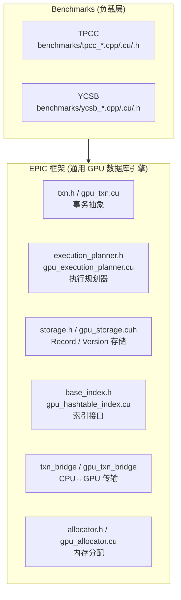

## 两层架构: EPIC (框架) + TPCC (负载)

这个项目是一个 **GPU 加速的数据库引擎**，分为清晰的两层：

---

### 🏗️ EPIC — GPU 数据库引擎框架（根目录，不含 `tpcc_`/`ycsb_` 前缀的文件）

EPIC 是通用的 GPU 事务处理框架，与具体 benchmark 无关。它提供：

| 模块 | 关键文件 | 职责 |
|------|---------|------|
| **事务抽象** | txn.h, gpu_txn.h, `gpu_txn.cu/.cuh` | `BaseTxn`、`TxnInputArray` 等泛型事务容器 |
| **执行规划器** | execution_planner.h, `gpu_execution_planner.cu/.h` | `OperationT` 枚举、`op_t` 编码、`TableExecutionPlanner` 基类、GPU 版执行规划 |
| **存储层** | storage.h, base_record.h, table.h, gpu_storage.cuh | `Record`/`Version` 模板、`readFromTable`/`writeToTable` |
| **索引基础设施** | base_index.h, hashtable_index.h, unordered_index.h, `gpu_hashtable_index.cu/.h` | 泛型 `BaseIndex<Key,Value>` 接口、Hash 索引 |
| **分配器** | allocator.h, `gpu_allocator.cu/.h` | GPU/CPU 内存分配抽象 |
| **事务桥** | `txn_bridge.h/.cpp`, `gpu_txn_bridge.cu/.cuh` | CPU ↔ GPU 数据传输 |
| **工具库** | `util_*` (15+ 文件) | 日志、数学、随机数、GPU 错误检查、warp 内存等 |
| **入口** | main.cpp | CLI 解析，根据 `-b` (benchmark) 和 `-d` (database) 分发 |



---

### 📊 TPCC — 负载/Benchmark（`benchmarks/tpcc_*` 文件）

TPCC 是跑在 EPIC 之上的 **具体业务负载**。它定义了：

| 模块 | 关键文件 | 职责 |
|------|---------|------|
| **数据定义** | tpcc_common.h | 9 张表的 C++ struct (Warehouse, District, Customer, Order, NewOrder, OrderLine, Item, Stock, History) |
| **配置** | tpcc_config.h | `TpccConfig`：warehouse 数、txn mix 比例 |
| **事务类型** | `benchmarks/tpcc_txn.h/.cpp` | 5 种 TPCC 事务的 struct (NewOrder, Payment, OrderStatus, Delivery, StockLevel) |
| **事务生成** | `benchmarks/tpcc_txn_gen.cpp/.h` | 随机生成 TPCC 事务参数 |
| **表存储** | tpcc_table.h, tpcc_storage.h | TPCC 表的初始化数据 |
| **GPU 辅助索引** | `benchmarks/tpcc_gpu_aux_index.cu/.h` | B+Tree 辅助索引 (Phase 2) |
| **GPU Hash 索引** | `benchmarks/tpcc_gpu_index.cu/.h` | cuco HashMap 主索引 (Phase 3) |
| **GPU 提交器** | `benchmarks/tpcc_gpu_submitter.cu/.h` | 事务提交 (Phase 4) |
| **GPU 执行器** | `benchmarks/tpcc_gpu_executor.cu/.h` | `gpuExecKernel` (Phase 6, 占 89% 耗时) |
| **CPU 备选** | `benchmarks/tpcc_cpu_*.cpp/.h` | CPU 端的备选执行路径 |
| **总控** | `benchmarks/tpcc.cpp/.h` | `TpccDb` 类，串联所有 Phase |
| **GPU Txn 打包** | `benchmarks/tpcc_gpu_txn.cu/.cuh` | Phase 1 的 kernel |

---

### 🔀 GACCO — 替代后端

gacco 目录下有一个 **更简单的 GPU 数据库后端**，与 EPIC 是竞争/对比关系：

| 对比维度 | EPIC (`-d epic`) | GACCO (`-d gacco`) |
|---------|-------------------|---------------------|
| op_t 编码 | record_id + txn_id + r/w + offset (复杂) | record_id + txn_id (简单) |
| 执行规划 | 5 种操作类型 (RecordA/B, Version) | 锁-based |
| 版本控制 | Record A/B + Version 三级 | 无 |

GACCO 也有自己的 TPCC 胶水代码：`gacco/benchmarks/tpcc_*`，但共享大部分 TPCC 数据结构定义。

---

### 📋 快速识别规则

```
文件路径                                  属于
─────────────────────────────────────────────────
benchmarks/tpcc_*.cpp / .cu / .h         TPCC 负载
benchmarks/ycsb_*.cpp / .cu / .h         YCSB 负载
gacco/benchmarks/tpcc_*.cpp / .cu / .h   GACCO 后端的 TPCC 胶水
gacco/benchmarks/ycsb_*.cpp / .cu / .h   GACCO 后端的 YCSB 胶水
gacco/*.h / .cu                          GACCO 后端框架
*.h / *.cu / *.cpp (根目录，无前缀)        EPIC 框架
```

简单来说：**EPIC 是"数据库内核"，TPCC 是"跑分软件"**。你 pipeline 文档中描述的 Phase 1-6 就是 EPIC 框架提供的通用流水线，由 TPCC 的 `TpccDb` 类填充具体的事务逻辑。